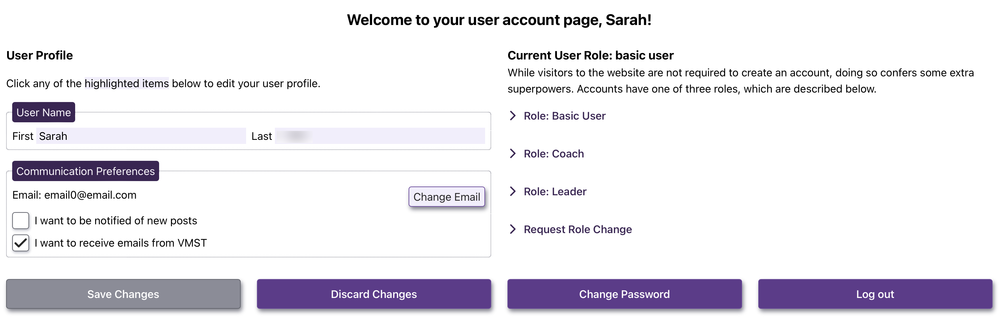
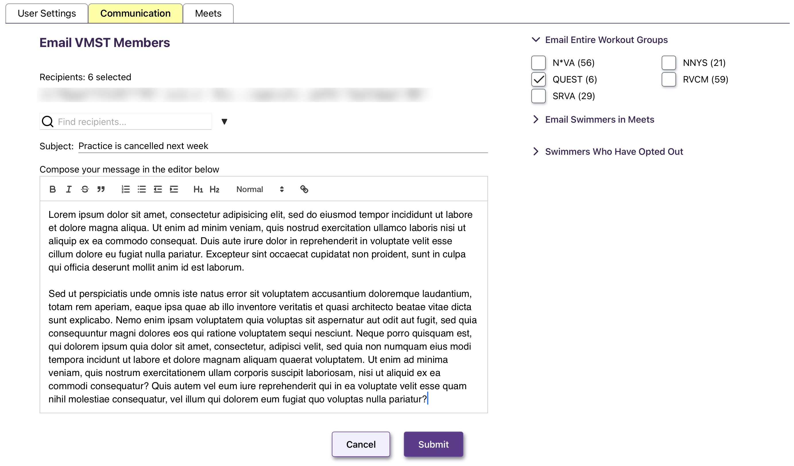
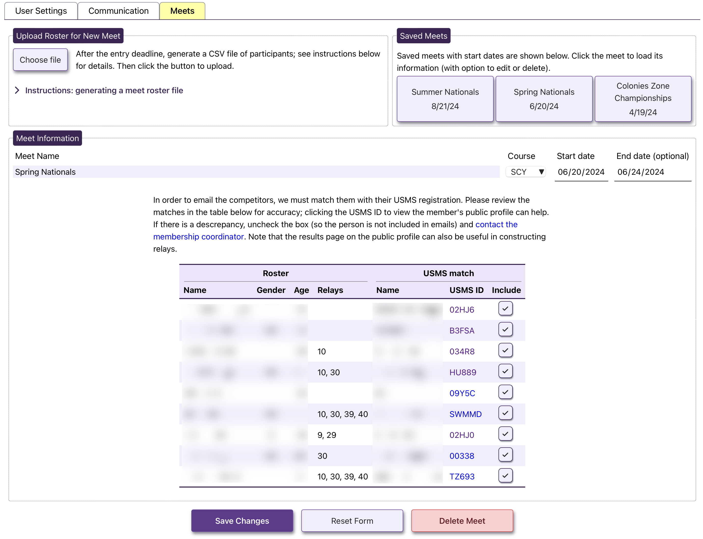

# VMST Communication Website

## Description
This is the demo of a proposed website for the Virginia Masters Swim Team (VMST), the largest adult swim team in Virginia. VMST is a member club of [US Masters Swimming](https://www.usms.org) (USMS), a national nonprofit adult swimming organization consisting of approximately 60,000 members.

The 300 members of VMST are geographically spread throughout the state and beyond; they even include two international members (one in Australia, one in Great Britain)! As one might imagine, team communication is a challenge; moreover, USMS policy prohibits the sharing of emails.

The primary purpose of this website is to facilitate communication between VMST leadership and members.

## Table of Contents
- [Installation](#installation)
- [Use](#use)
- [Questions](#questions)
- [Contributions](#contributions)
- [License](#license)

## Deployment
The demo website is [deployed on Render](https://vmst-website.onrender.com):

<https://vmst-website.onrender.com>

If VMST team leadership adopts this website we will eventually procure a domain name, which will be published here.

## Use

There are a number of intended uses of this website:

- to inform visitors to the website about the activities Virginia Masters Swim Team, giving them the option to contact team leadership (via email form) if they want more information.
- VMST team members can create an account which will allow them to manage their communication preferences (ie, if they wish to receive team emails or wish to be notified of new VMST blog posts)
- VMST coaches can create an account to allow them to communicate with the members of their workout group
- VMST team leaders can email any VMST team member and can upload meet rosters, allowing them to email swimmers going to an upcoming competition and to construct relays. Leaders are also able to create new blog posts, or update/delete existing posts.

A visitor to the website will be greeted with the latest news (as blog posts), as shown in the screenshot below.

Clicking the "Log In" menu item will prompt for an email and password; visitors can also use this modal to create a new account. One does not need to be a VMST team member to create an account. New accounts are automatically assigned a "User" role and have some basic settings, most importantly to manage communication preferences. A screenshot of the User Settings is shown below.

There are three additional types of users beyond the basic. Clicking on the "Request Role Change" reveals a form by which the user can request an upgraded role, which allows for additional capabilities. Additional roles (which are described to the user) include:

- team leaders, consisting of the VMST President, Vice-President, Secretary and their proxies. Only team leaders can create new posts. Any visitor or user may contact team leaders using the "Contact" page.
- coaches of workout groups. Workout groups are official VMST sub-groups that usually all practice in the same pool. Coaches can view their roster and communicate with their workout group members.

There are also two "hidden" roles that are related to administration of the website.

- website administrators for tasks such as comment moderation, resetting passwords, and website maintenance.
- the Virginia LMSC Membership Coordinator (email: VAMembership@usms.org) is responsible for updating the website's USMS membership database so that current emails of all VMST members can be used for communication. There should be only one user with this role, and they will need to update the membership data routinely, roughly every 1-2 weeks and on request of team leadership.

When a leader or coach logs in, they are presented with additional tabs on the user page. One of those is the communications page, which allows the coach or leader to send emails to VMST members. A screenshot example is shown below, showing how a coach might communicate with their group members. A rich text editor is used in case the coach/leader wants to apply additional formatting to the message.

Leaders and coaches can also upload the rosters for upcoming meets, allowing for communication with meet competitors (eg when composing relays or planning social gatherings at the meet). The screenshot below shows how this might work.

In order to communicate with the competitors, a match needs to be found between each person on the meet roster and the registered members of VMST. The Meets tab allows for review of these matches (which are based on name and gender) to make sure it is accurate. Once a meet is created in the database, it is available on the Communications tab for email messages.

## Contributions
The [first version website](https://github.com/Spikey1289/VMST-Communication-Website) was initially created by the following individuals: Ian Stevenson, Chris Stevenson, De'Shawn Pair, and Brian Guthrie. Future development will continue on this fork by two collaborators:

- Chris Stevenson (chrislstevenson@gmail.com)
- Ian Stevenson (ianmstevenson1@gmail.com)

## License
This project is licensed under the terms of the [MIT license](https://opensource.org/licenses/MIT).
